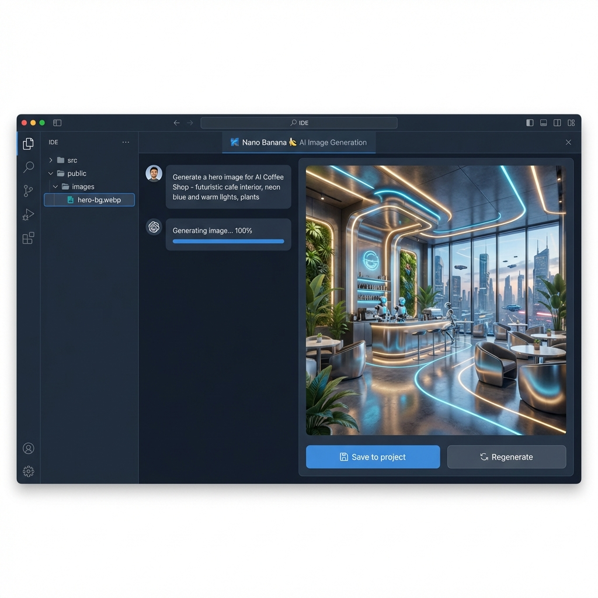
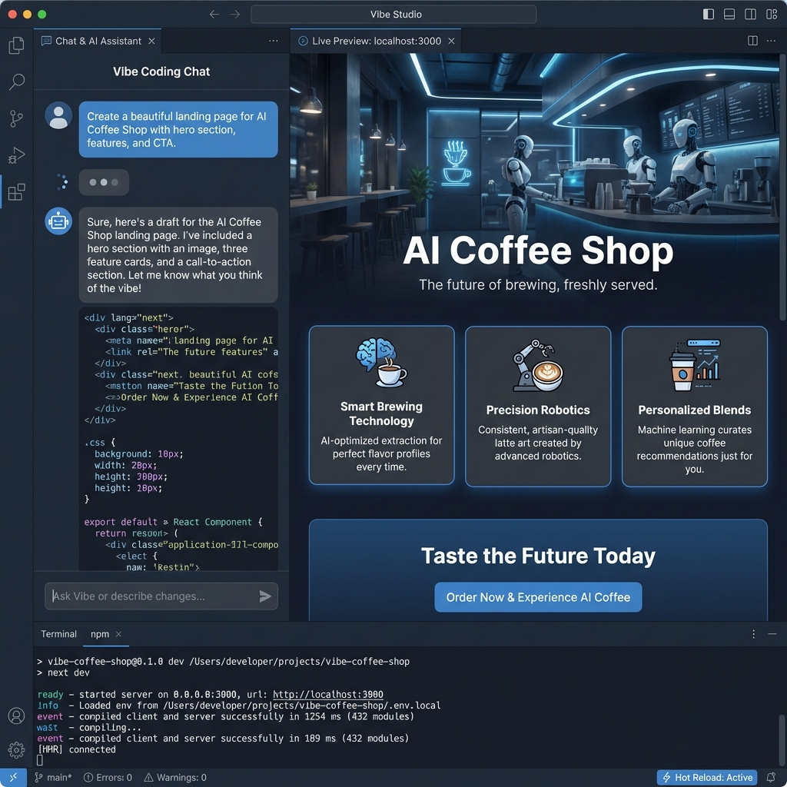

# Step 3: Vibe Coding 基礎編

MCP や Skills を使わず、シンプルにバイブコーディングを体験します。

## 学習目標

- Antigravity との基本的な対話方法を身につける
- 自然言語でコードを生成する感覚をつかむ
- Nano Banana で画像を生成してみる
- すぐに動く Web ページを一つ作る

## 所要時間

20分

## 前提条件

- Step 1 の環境セットアップが完了している
- Step 2 の GEMINI.md 設定が完了している
- Antigravity が起動している

---

## ハンズオン開始

### Part 1: シンプルな HTML ページを作成（5分）

#### 1.1 新しいプロジェクトフォルダを作成

Antigravity に、こう指示してください。

```
新しいフォルダ「my-first-vibe」を作成して、その中にシンプルなHTMLファイルを作って。
テーマは「自己紹介ページ」で、モダンでおしゃれなデザインにして。
```

こうなれば OK です:
- `my-first-vibe/` フォルダが作成される
- `index.html` が生成される
- CSS がインラインまたは別ファイルで適用される

#### 1.2 プレビューを確認

```
作成したHTMLファイルをブラウザでプレビューして
```

---

### Part 2: デザインをカスタマイズ（5分）

#### 2.1 色を変更

```
背景色をダークモードに変更して。
アクセントカラーは青緑系（#4ecca3）にして。
```

#### 2.2 アニメーションを追加

```
名前の部分にふわっと表示されるアニメーションを追加して
```

#### 2.3 レスポンシブ対応

```
スマホでも綺麗に見えるようにレスポンシブ対応して
```

一度に複数の変更を頼んでも、AI が順番に対応してくれます。気に入らなければ「元に戻して」と言えば大丈夫です。

---

### Part 3: Nano Banana で画像生成（10分）

#### 3.1 プロフィール画像を生成

```
Nano Bananaで、プロフィール用のアバター画像を生成して。
- スタイル: アニメ風またはイラスト風
- 背景: シンプルなグラデーション
- サイズ: 正方形
ファイル名は「avatar.png」で保存して。
```

#### 3.2 背景画像を生成

```
Nano Bananaで、ヘッダー用の背景画像を生成して。
- テーマ: 抽象的な波模様
- 色: 紺から青緑へのグラデーション
- 幅広い横長画像
ファイル名は「header-bg.png」で保存して。
```

#### 3.3 生成した画像を HTML に適用

```
生成したavatar.pngとheader-bg.pngを自己紹介ページに配置して。
- avatar.pngは丸くトリミングしてプロフィール欄に
- header-bg.pngはヘッダーの背景に
```

---

## 完成イメージ

```
my-first-vibe/
├── index.html          # メインページ
├── style.css           # スタイルシート
├── avatar.png          # プロフィール画像（Nano Banana で生成）
└── header-bg.png       # 背景画像（Nano Banana で生成）
```

### Nano Banana での画像生成



### Vibe Coding の実践



### 完成したページの特徴

- ダークモードのモダンなデザイン
- ふわっと表示されるアニメーション
- レスポンシブ対応
- AI 生成のオリジナル画像

---

## Vibe Coding のコツ

### 1. 具体的に伝える

```
❌ 「かっこいいページを作って」
✅ 「ダークモードで、青緑のアクセントカラー、グラスモーフィズムのカードデザインで作って」
```

### 2. 段階的に進める

```
❌ 「完璧なポートフォリオサイトを作って」
✅ 「まずシンプルな自己紹介ページを作って」→「次にスキルセクションを追加して」
```

### 3. フィードバックを活用

```
「もう少し余白を増やして」
「フォントサイズを大きくして」
「もっとシンプルにして」
```

### 4. 失敗を恐れない

```
「元に戻して」
「別のパターンを3つ提案して」
「参考にしたいサイトのURLを見て、同じようなデザインにして」
```

---

## チャレンジ課題

時間に余裕があれば、以下にも挑戦してみましょう。

### 初級
- アイコンを追加する（Font Awesome など）
- SNS リンクを追加する
- フッターを追加する

### 中級
- ダークモード / ライトモードの切り替えボタンを追加
- スクロールアニメーションを追加
- お問い合わせフォームを追加

### 上級
- 複数ページ構成にする
- JavaScript でインタラクティブな要素を追加
- ローカルストレージで設定を保存

---

## 振り返り

### 学んだこと

- 自然言語で HTML を生成できた
- CSS のカスタマイズを対話で行えた
- Nano Banana で画像を生成できた
- 生成した画像を HTML に組み込めた

### 感じたこと

```
（ここにあなたの感想を書いてみましょう）

例:
- コードを書かずにWebページが作れるのは衝撃的だった
- 画像生成がこんなに簡単だとは思わなかった
- 細かい調整は人間が指示した方が良さそう
```

---

## エディタの AI 機能も活用しよう

Vibe Coding をさらに効率よく進めるためのエディタ機能があります。

| 機能 | ショートカット | 説明 |
|:---|:---|:---|
| **Supercomplete** | `Tab` | 複数行のコード提案を採用 |
| **Tab-to-Jump** | `Tab` | 次の編集箇所に自動ジャンプ |
| **Command** | `Cmd + I` | 自然言語でコード変更を指示 |

> 詳しくは公式ドキュメント: https://antigravity.google/docs/tab

---


---

## Pro Tips: 実装計画書（Implementation Plan）の確認ポイント

AI が提案してくる「実装計画書」や「タスクリスト」は、承認（Proceed）する前にしっかり確認すると手戻りが減ります。

### 1. 最初にチェックすること

- **Git の初期化（git init）** が含まれているか？
  - なければ「最初に git init を追加して」と指示しましょう。
- **日本語になっているか？**
  - 英語の場合は「計画書を日本語にして」と修正させましょう。

### 2. ロジックと例外処理を詰め込む

AI は「正常に動く」ケースは得意ですが、エラー時の挙動は見落としがちです。計画書の段階で以下のような指示を追加（コメント作成やチャットで指示）すると品質が上がります。

- **入力制限**: 「未来の日付は選択できないようにする」
- **エラー処理**: 「通信エラー時はリトライボタンを表示する」
- **セキュリティ**: 「APIキーは直書きせず環境変数を使う」

計画書の気になった箇所をクリックしてコメントを入れるか、チャットで「〇〇の場合はどうなる？エラー処理を追加して」と指示して、計画書を **Update** させてから承認しましょう。

---

## 次のステップ

Step 4 の MCP 接続に進みましょう。

MCP を使うと、Antigravity でさらに広い範囲のことができるようになります。
- ブラウザ操作（Web リサーチ、自動テスト）
- データベース接続
- 外部 API 連携

[Step 4: MCP 接続へ →](../04_mcp/README.md)

---

## トラブルシューティング

### Q: 画像が生成されない

Free プランの月間制限（50枚）に達していないか確認してください。プロンプトが抽象的すぎると失敗しやすいので、具体的に書くとよいです。

### Q: HTML が期待通りにならない

指示をもっと具体的にしてみてください。「ボタンの色を #4ecca3 に」のように、値を直接伝えると精度が上がります。

### Q: 変更が反映されない

ブラウザのキャッシュをクリアするか、強制リロード（Cmd+Shift+R）を試してください。

---

基本的な Vibe Coding はここまでです。MCP や Skills がなくても、これだけのことが対話だけでできます。

次のステップでは、さらに強力な機能を使っていきましょう。
