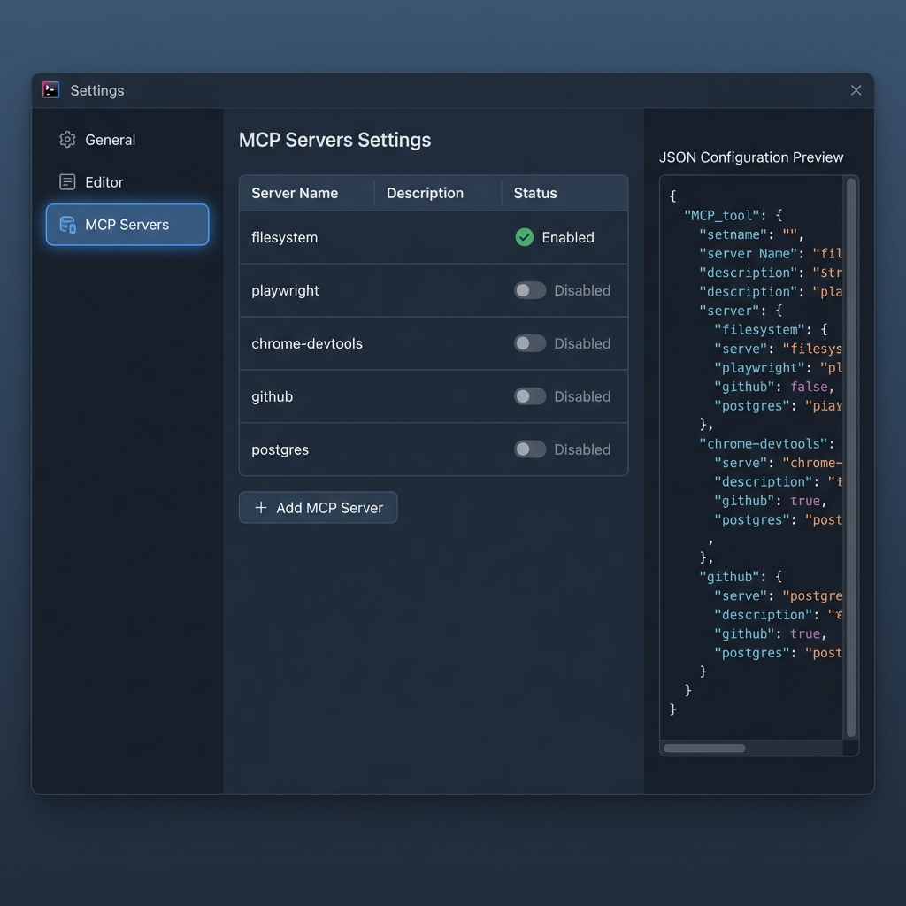

# 🔌 Hands-on 04: MCP (Model Context Protocol) 接続

## 目標
MCP を使ってエージェントを外部ツールやデータに接続する方法を学ぶ。

---

## 📖 MCP とは？

**MCP (Model Context Protocol)** は、AI エージェントと外部システムを安全に接続するための**オープン標準**です。

> 📖 公式ドキュメント: https://antigravity.google/docs/mcp

### MCP でできること

| 機能 | 説明 | 例 |
|:---|:---|:---|
| **Context Resources** | AI がリアルタイムデータを読み取り | SQL スキーマ、ビルドログ |
| **Custom Tools** | AI がアクションを実行 | GitHub Issue 作成、Notion 検索 |
| **MCP Store** | GUI で簡単に MCP を追加・管理 | ワンクリックで有効化 |

### MCP の主な連携先

Google Search, GitHub, Slack, Jira, PostgreSQL, Notion など多数のサービスに対応しています。

---

## ✅ ハンズオン: MCP を設定しよう

### Step 1: MCP Store を開く

Antigravity の Agent パネルで：
1. 右上の `...`（三点メニュー）をクリック
2. **MCP Store** を選択



> 💡 MCP Store は GUI で MCP サーバーの追加・管理ができるビルトイン機能です

### Step 2: 利用可能な MCP を確認

MCP Store では、以下のようなサーバーが一覧表示されます：

| MCP サーバー | 用途 | 設定方法 |
|:---|:---|:---|
| `filesystem` | ローカルファイルの読み書き | デフォルト有効 |
| `chrome-devtools` | Chrome ブラウザ操作・DevTools | MCP Store から追加 |
| `playwright` | ブラウザ自動化・テスト | MCP Store から追加 |
| `context7` | 最新ライブラリドキュメント参照 | MCP Store から追加 |
| `serena` | 大規模コードベース解析 | MCP Store から追加 |
| `postgres` | PostgreSQL 接続 | MCP Store から追加 |
| `github` | GitHub API 連携 | MCP Store から追加 |

### Step 3: MCP サーバーを追加する

#### 方法 1: MCP Store（推奨）
MCP Store で使いたいサーバーを選択 → **Install** ボタンをクリック

#### 方法 2: 手動設定
設定ファイルに直接記述する方法もあります：

```json
{
  "mcpServers": {
    "playwright": {
      "command": "npx",
      "args": ["-y", "@anthropic/mcp-playwright"]
    },
    "context7": {
      "command": "npx",
      "args": ["-y", "@context7/mcp"]
    }
  }
}
```

---

## 🎯 やってみよう: MCP を使ったリサーチ

MCP（Browser）が有効な状態で、以下を試してください：

### 演習 1: Web検索

```
Google で「Antigravity IDE 2026」を検索して、
トップ3件の記事タイトルを教えて。
```

**期待される動作**:
1. エージェントが Browser MCP を使用
2. Google 検索を実行
3. 結果を取得して報告

### 演習 2: ドキュメント参照

```
Context7 MCP を使って、React の useEffect フックの
最新の使い方を調べて教えて。
```

**期待される動作**:
1. context7 MCP がライブラリを検索
2. 最新のドキュメントからコード例を取得
3. 日本語で解説

---

## 📌 おすすめ MCP 構成

### 開発者向け基本セット

| MCP | 主な用途 | おすすめ度 |
|:---|:---|:---:|
| **playwright** | E2E テスト、Web スクレイピング | ⭐⭐⭐ |
| **context7** | 最新ライブラリドキュメント参照 | ⭐⭐⭐ |
| **chrome-devtools** | ブラウザ開発者ツール操作 | ⭐⭐ |
| **serena** | 大規模コードベース解析 | ⭐⭐ |
| **github** | PR作成、Issue管理 | ⭐⭐ |

---

## ⚠️ セキュリティ注意

- MCP は強力な権限を持つため、**信頼できるサーバーのみ**を有効化
- API キーは**環境変数**で管理（直書き禁止）
- ネットワークアクセスが必要な MCP は**ファイアウォール設定**を確認

---

**次へ進む → [05_skills](../05_skills/README.md)**
