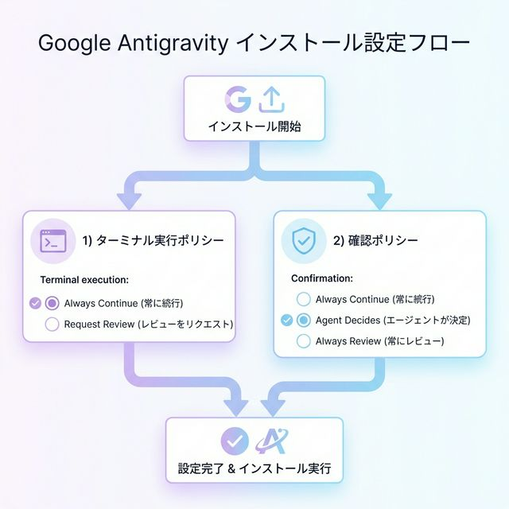
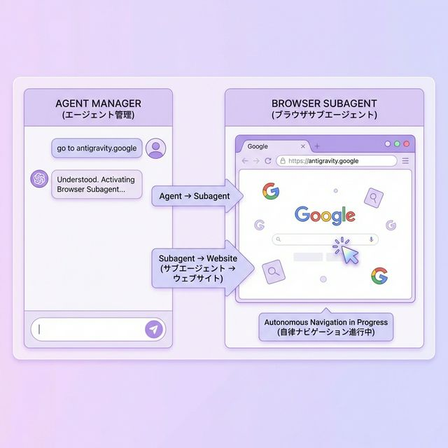
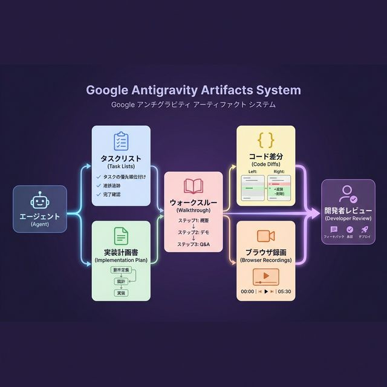
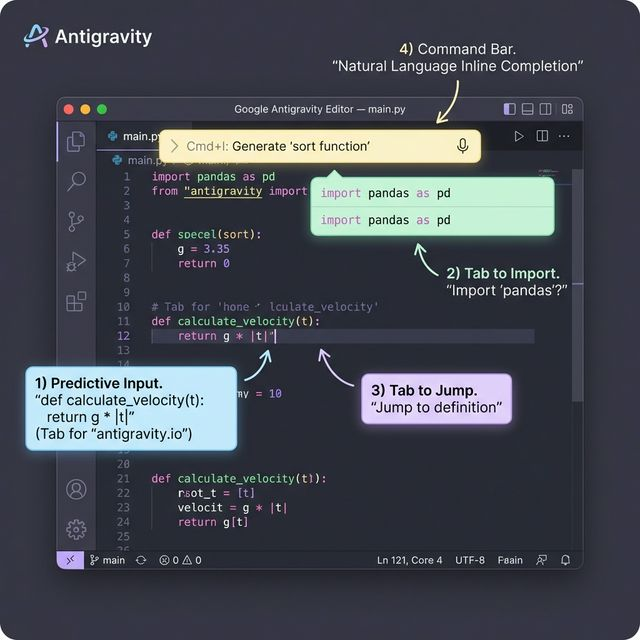
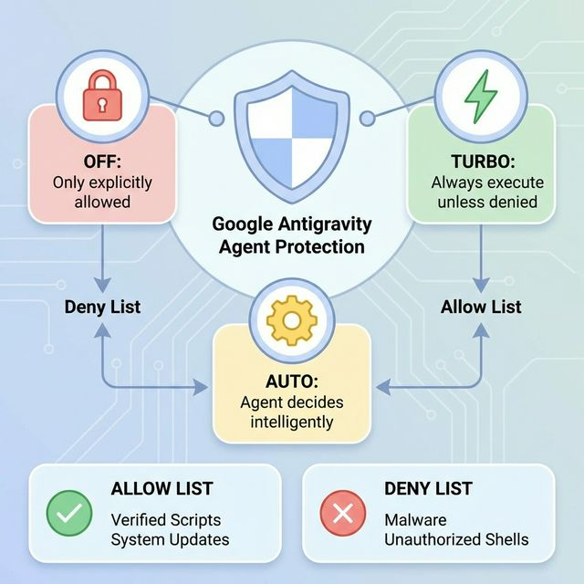
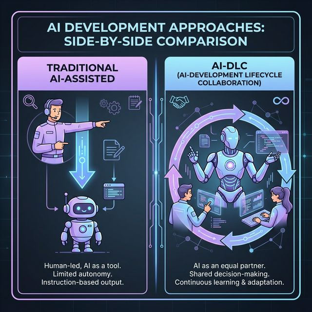
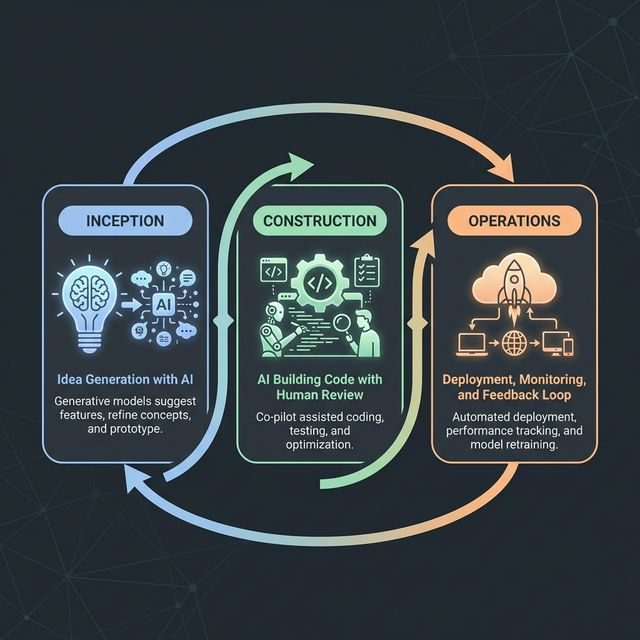
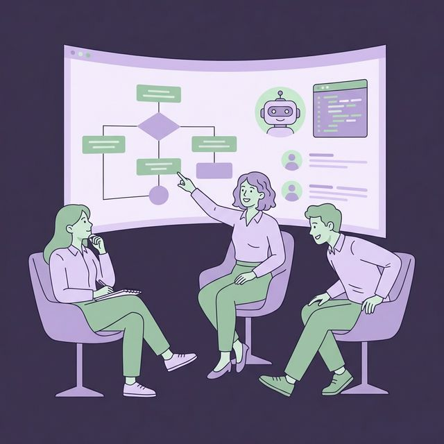

<!-- _class: lead -->


# Let's build with ✦ Gemini 3
## in Google Antigravity

<p style="font-size:20px; color:#9b82b5; font-weight:700; margin-top:8px;">Supported by <strong style="color:#7060a0;">GoogleAI学生アンバサダープログラム</strong></p>

<p style="font-size:18px; color:#b0a0c8; margin-top:4px;">📅 2026年3月7日(土) 19:00〜21:00 ｜ 🌐 オンライン開催</p>

---

<!-- _class: bg-lav -->

#  イベント概要

<div class="cols">

<div class="card card-lav">
<h3> 開催情報</h3>
<ul>
<li><strong>日時</strong>：3/7(土) 19:00〜21:00</li>
<li><strong>場所</strong>：オンライン</li>
<li><strong>対象者</strong>：18歳以上の学生</li>
<li><strong>主催</strong>：GoogleAI学生アンバサダー</li>
<li><strong>協力</strong>：Google Developer Groups on Campus Japan</li>
</ul>
</div>

<div class="card card-blue">
<h3> 注意事項</h3>
<p>Gemini Developer API の規約により、<strong>18歳以下の方はご参加いただけません</strong>。</p>
<h3 style="margin-top:12px;"> 関連イベント</h3>
<p style="font-size:18px;">GDGoC Japan Hackathon<br>Supported by ACMEE / TrNaDo2026</p>
</div>

</div>

---

#  kozzy (@kozzy0919) | 山岡 滉治（やまおか こうじ）

## **データ・AI企画推進 / Developer Relations**

新卒よりBtoBクラウドサービスのインフラ/サーバーエンジニア → Webサービス開発 → 現在はデータ・AI企画推進チームにて**生成AI活用の企画・推進**を担当

<h3 style="margin-top: 14px;"> 主要な実績</h3>
<ul style="margin-top: -6px;">
<li>GitHub Copilot導入で全社利用率を60%に向上</li>
<li>社内生成AIコミュニティを200名→2,000名以上に成長</li>
<li>生成AI活用の新機能企画・業務改善プロジェクトを推進</li>
</ul>

<h3 style="margin-top: 14px;"> その他の活動</h3>
<ul style="margin-top: -6px;">
<li>📚 2025年3月 「開発系エンジニアのためのGit/GitHub絵とき入門」出版 (秀和システム)</li>
<li>👨‍🏫 小中学生向けプログラミングスクール講師</li>
</ul>

---

<!-- _class: bg-blue -->

#  本日のアジェンダ

<div class="card card-blue" style="padding:10px 10px;margin:6px 0; padding-bottom:px">
<h3 style="margin-bottom:4px; margin-top:0px;"> 学習目標</h3>
<strong>Antigravityを使いこなし、ハッカソンで圧倒的な開発速度を実現する</strong>
</div>

| 時間 | 内容 | 詳細 |
|:---:|:---|:---|
| **5分** |  課題提起 | 従来の開発の問題点 |
| **10分** |  Antigravityとは | 基本概念と革新性 |
| **15分** |  技術詳細 | Architecture / MCP / Skills |
| **20分** |  Vibe Coding | 実践デモ |
| **5分** |  まとめ | 次のステップ |
| **15分** |  Q&A | 質問・ディスカッション |

<p class="sm center" style="margin-top:6px;"> 合計約2時間（19:00〜21:00）</p>

---

<!-- _class: bg-pink -->

#  こんな経験ありませんか？

<div class="cols">

<div class="warn">
<h3> 個人開発はじめの一歩...</h3>
<div style="display:flex; flex-direction:column; gap:12px;">
<p style="margin:0;"> <strong>環境構築で挫折</strong><br><span style="font-size:0.9em;">「React入れて...」のエラー解決だけで休日が終わる。</span></p>
<p style="margin:0;"> <strong>「動かない」が直せない</strong><br><span style="font-size:0.9em;">Qiita通りにやったはずなのに...。何が違うのか分からず放置。</span></p>
<p style="margin:0;"> <strong>デザインで力尽きる</strong><br><span style="font-size:0.9em;">機能は作ったけど、見た目がショボくて誰にも見せられない。</span></p>
</div>
</div>

<div class="ok">
<h3> Antigravityなら</h3>
<div style="display:flex; flex-direction:column; gap:12px;">
<p style="margin:0;"> <strong>環境構築ゼロ秒</strong><br><span style="font-size:0.9em;">「ToDoアプリ作りたい」→ 30秒後にはすでに動いている。</span></p>
<p style="margin:0;"> <strong>エラーはAIが勝手に直す</strong><br><span style="font-size:0.9em;">君が悩む前に、AIがあらゆる手段で原因を特定・修正。</span></p>
<p style="margin:0;"> <strong>プロ級UIが一瞬で</strong><br><span style="font-size:0.9em;">「おしゃれにして」だけで、ポートフォリオ級のデザインに。</span></p>
</div>
</div>

</div>

<div class="note">
 開発時間を<strong>70%削減</strong>し、創造性を最大化するのがAntigravityの目標です。
</div>

---

<!-- _class: bg-lav -->

#  Google Antigravityとは？

> 2025年11月発表の革新的なIDE（VS Codeフォーク）。従来の「コード補完」から**「自律的AIパートナー」**へのパラダイムシフトを実現。Gemini 3 Deep Think搭載。

<div class="hl">
<h2> 3つの革新ポイント</h2>

<div class="cols">

<div>
<h3><span class="num">1</span> Agent-First Architecture</h3>
<p>AIが単なるツールではなく、タスクの計画・実行・検証までを担う<strong>自律的なパートナー</strong>として機能します。</p>
</div>

<div>
<h3><span class="num">2</span> Dual View System</h3>
<p><strong>Agent Manager</strong>（司令塔）でエージェントを指揮し、<strong>Editor View</strong>（作業場）でコードを書く。<code>Cmd+E</code>で切り替え。</p>
</div>

</div>

<h3><span class="num">3</span> Multi-Model Support</h3>
Gemini 3 Pro/Flash、Claude Sonnet/Opus 4.5、Nano Banana Proなど複数のAIモデルを目的に応じて使い分けられます。

</div>

---

#  従来のAIツールとの違い

| 項目 | GitHub Copilot | Cursor | **Antigravity** |
|:---|:---:|:---:|:---:|
| **役割** | コード補完 | AI編集支援 | **自律エージェント** |
| **タスク実行** | 手動 | 半自動 | **完全自律** |
| **複数モデル** |  | 一部 |  |
| **ブラウザ操作** |  |  |  |
| **画像生成** |  |  |  |
| **MCP対応** |  | 限定的 |  |

---

<!-- _class: bg-green -->

#  Antigravityの哲学

<div class="hl">
<h2> 「重力からの解放」</h2>

開発者は<strong>「何を創るか（What）」に集中すべき</strong>。環境構築、定型作業、ドキュメント、デザイン素材──これらはすべてAIに任せる。

<div class="gap">
<div class="card card-blue" style="flex:1;text-align:center;"> 環境構築→AIへ</div>
<div class="card card-pink" style="flex:1;text-align:center;"> 定型作業→AIへ</div>
<div class="card card-orange" style="flex:1;text-align:center;"> ドキュメント→AIへ</div>
<div class="card card-green" style="flex:1;text-align:center;"> デザイン→AIへ</div>
</div>

<p class="center" style="font-size:24px;font-weight:900;color:#8060a8;margin-top:10px;">これが Vibe Coding の真髄 ― "Don't write code, just vibe."</p>
</div>

---

<!-- _class: bg-blue -->

#  Agent-First Architecture

<div class="card card-lav center" style="padding:10px 16px;">

<strong>開発者</strong> が自然言語で指示
<div class="arrow">↓</div>
 <strong>Manager View</strong> が受け取り、各エージェントへ分配
<div class="arrow">↓</div>
<div class="gap" style="justify-content:center;">
<div class="card card-blue"> Planner</div>
<div class="card card-green"> Coder</div>
<div class="card card-pink"> Designer</div>
<div class="card card-orange"> Reviewer</div>
</div>
<div class="arrow">↓</div>
 <strong>Artifacts</strong>（成果物）として統合
</div>

---

<!-- _class: bg-lav -->

#  Dual View System

<div class="cols">

<div class="card card-lav">
<h3> Agent Manager（司令塔）</h3>
<p>チャット形式で自然言語のタスク依頼ができるインターフェース。エージェントの動作をリアルタイムで監視・管理し、Artifacts（成果物）もここで確認できます。</p>
</div>

<div class="card card-blue">
<h3> Editor View（作業場）</h3>
<p>VS Code互換のエディタ。<code>Cmd+I</code> でCommand（自然言語で指示）、<code>Tab</code> でSupercomplete（コード補完）。AI機能が組み込まれたエディタです。</p>
</div>

</div>

<div class="note">
 <code>Cmd+E</code> で Agent Manager ↔ Editor を素早く切り替えできます。<br>
<strong>💡 Inbox（受信トレイ）</strong> で過去の会話や複数の並行タスクをいつでも管理・再開可能です。
</div>

---

<!-- _class: bg-orange -->

#  Multi-Model Support

### 🧠 推論モデル（選択可能）

| モデル | 特徴 |
|:---|:---|
| **Gemini 3 Pro** (High/Low) | Google最新。総合力・論理的思考 |
| **Gemini 3 Flash** | 高速レスポンス |
| **Claude Sonnet 4.5** | 文脈理解・自然な文章 |
| **Claude Opus 4.5** | 高精度（Thinkingモード） |
| **GPT-OSS** | OpenAI互換 |

### 🎨 バックグラウンドモデル（自動選択）

| モデル | 役割 |
|:---|:---|
| **Nano Banana Pro** | 画像生成・UIモックアップ |
| **Gemini 2.5 Pro UI Checkpoint** | Browser Subagent（ブラウザ操作） |
| **Gemini 2.5 Flash** | チェックポイント・コンテキスト要約 |

<div class="note" style="margin-top:14px;">
<h3 style="margin-top:0; font-size:22px;"> 実行モード（Planning / Fast）</h3>
<p style="margin-bottom:0; font-size:18px;">
<strong>Planning モード</strong>: 実装前に「計画書」を作成する。詳細な調査や複雑なタスクに最適。<br>
<strong>Fast モード</strong>: 計画書作成を省き、すぐにコードを生成する高速モード。
</p>
</div>

---

<!-- _class: bg-pink -->

#  Nano Banana（画像生成AI）

<div class="hl">

###  エンジニアがデザイン素材を即座に用意

```
「このヘッダーに合う背景画像を生成して（Nano Banana）」
```

<div class="arrow">↓</div>

生成された画像が `public/images/` に自動保存・配置されます。

<div class="gap" style="margin-top:12px;">
<div class="card card-green" style="flex:1;"> デザイナーを待つ必要なし</div>
<div class="card card-blue" style="flex:1;"> プロトタイプが高速化</div>
<div class="card card-orange" style="flex:1;"> イメージ通りの素材を入手</div>
</div>

</div>

---

<!-- _class: bg-green -->

#  MCP（Model Context Protocol）

> AIエージェントを外部ツールに安全に接続するためのオープン標準（Linux Foundation Project）。

<div class="cols">

<div>

###  2つの主要機能

<div class="card card-blue"><strong>Context Resources</strong>：AIがリアルタイムデータを読み取り（SQLスキーマ、ビルドログ等）</div>
<div class="card card-green"><strong>Custom Tools</strong>：AIがアクションを実行（GitHub Issue作成、Notion検索等）</div>

</div>

<div>

###  接続可能なツール（エコシステム拡大中）

<div class="gap">
<div class="card card-blue" style="flex:1;"> <strong>Browser</strong><br>Playwright</div>
<div class="card card-green" style="flex:1;"> <strong>Filesystem</strong></div>
<div class="card card-lav" style="flex:1;"> <strong>GitHub / GitLab</strong></div>
</div>
<div class="gap">
<div class="card card-orange" style="flex:1;"> <strong>PostgreSQL / MySQL</strong></div>
<div class="card card-pink" style="flex:1;"> <strong>Slack / Linear</strong></div>
<div class="card card-blue" style="flex:1;"> <strong>Context7 / Sentry</strong></div>
</div>

</div>

</div>

<div class="note">
 ビルトインの <strong>MCP Store</strong> でGUIから簡単にサーバーを追加・管理できます。
</div>

---

<!-- _class: bg-lav -->

#  Rules / Workflows / GEMINI.md（AGENTS.md）

<div class="cols">

<div>

###  Rules（ルール）

エージェントの振る舞いを制御する**持続的な指示**。`GEMINI.md`（別名 `AGENTS.md`）に記述します。

```markdown
# プロジェクト設定
## 基本ルール
- 常に日本語で応答してください
- コードには必ずコメントを入れてください
## 技術スタック
- React + TypeScript / TailwindCSS / Vite
```

**Activation Mode**: Always On / Manual (`@名前`) / Glob (`src/**/*.ts`)

</div>

<div>

###  Workflows（ワークフロー）

繰り返しタスクの自動化。`/名前` で実行します。

```markdown
# .agent/workflows/deploy.md
---
description: デプロイ手順
---
1. テストを実行
2. ビルドを実行
3. デプロイコマンドを実行
```

実行: `/deploy`

</div>

</div>

---

#  Tips: Rules の使い分け

<div class="cols">

<div class="card card-lav">
<h3> Global Rules（全共通）</h3>
<p>すべてのプロジェクトに適用したい基本ルール。</p>
<ul>
<li><strong>言語設定</strong>: 「常に日本語で応答して」</li>
<li><strong>基本姿勢</strong>: 「コードにはコメントを入れて」</li>
</ul>
<p class="sm" style="margin-top:8px;">設定: <code>Customizations > Rules > Global</code></p>
</div>

<div class="card card-blue">
<h3> Workspace Rules（個別）</h3>
<p>プロジェクトや技術スタックごとのルール。</p>
<ul>
<li><strong>技術スタック</strong>: React / Python / Go</li>
<li><strong>命名規則</strong>: camelCase / snake_case</li>
</ul>
<p class="sm" style="margin-top:8px;">設定: <code>.agent/rules/</code> または <code>GEMINI.md</code></p>
</div>

</div>

<div class="note">
 まずは <strong>Global</strong> で「日本語化」を設定するのがおすすめです。
</div>

---

#  Agent Skills


<a href="https://agentskills.io">agentskills.io</a> オープン標準に基づく、エージェントに**専門的な能力をパッケージとして追加**する仕組みです。
 
 <div class="gap">
 <span class="card card-lav" style="padding:4px 12px; font-size:18px;">code-review</span>
 <span class="card card-lav" style="padding:4px 12px; font-size:18px;">doc-generator</span>
 <span class="card card-lav" style="padding:4px 12px; font-size:18px;">test-gen</span>
 <span class="card card-lav" style="padding:4px 12px; font-size:18px;">flutter-expert</span>
 </div>

<div class="cols">

<div class="card card-lav">
<h3> SKILL.md の構造</h3>

```markdown
---
name: code-review
description: コードの品質レビューを行う
---
# コードレビュー手順
1. 指定ファイルを読み込む
2. セキュリティ脆弱性を確認
3. 変数名・パフォーマンスをチェック
```

</div>

<div class="card card-blue">
<h3> 配置場所</h3>
<p><strong>ワークスペース</strong>:<br><code>.agent/skills/&lt;name&gt;/SKILL.md</code></p>
<p><strong>グローバル</strong>:<br><code>~/.gemini/antigravity/skills/&lt;name&gt;/SKILL.md</code></p>
<p style="margin-top:10px;"> 単一の責任に集中</p>
<p> 明確な名前と説明</p>
</div>

</div>

<p class="center" style="font-size:22px;font-weight:700;color:#8060a8;margin-top:10px;">「@code-review して」と頼むだけで実行されます</p>

---

<!-- _class: bg-orange -->

#  料金プラン

<div class="cols-3">

<div class="card card-green center">

<h3>Free</h3>
<p style="font-size:28px;font-weight:900;color:#6bb86a;">無料</p>
<p class="sm">Gemini 3 Pro（Rate Limitあり）<br>Nano Banana（月50枚）<br>ローカルMCP</p>
</div>

<div class="card card-blue center">

<h3>Pro</h3>
<p style="font-size:28px;font-weight:900;color:#6daad8;">$19/月</p>
<p class="sm">Gemini 3 Pro（High Priority）<br>Claude Sonnet 4.5<br>Nano Banana（無制限）<br>クラウドMCP</p>
</div>

<div class="card card-lav center">

<h3>Enterprise</h3>
<p style="font-size:28px;font-weight:900;color:#9b82b5;">要相談</p>
<p class="sm">チーム共有Artifacts<br>Enterpriseセキュリティ<br>カスタムモデル / SSO</p>
</div>

</div>

<p class="center" style="margin-top:12px;"><strong>学生でもFreeプランで十分に活用できます</strong></p>

---

<!-- _class: bg-blue -->

#  インストール方法

<div class="card card-blue">

<p><span class="num">1</span> <strong>公式サイトへアクセス</strong> ― <a href="https://antigravity.google">antigravity.google</a></p>

<p><span class="num">2</span> <strong>ダウンロード</strong> ― macOS / Windows / Linux に対応</p>

<p><span class="num">3</span> <strong>ログイン</strong> ― Googleアカウントでサインインするだけ</p>

</div>

<div class="card card-lav" style="margin-top:10px;">
<h3> システム要件</h3>
<p><strong>macOS</strong>: v12 (Monterey)以上 ※Apple Siliconのみ &nbsp;/&nbsp; <strong>Windows</strong>: 10 (64-bit)以上 &nbsp;/&nbsp; <strong>Linux</strong>: glibc >= 2.28</p>
</div>

<p class="center" style="font-size:24px;font-weight:700;color:#5a4d78;margin-top:12px;">
 5分で開発環境が整います
</p>

---

<!-- _class: bg-lav -->

#  インストール時の設定ポリシー



###  ターミナル実行ポリシー

<div class="card card-lav">
<ul>
<li><strong>常に続行</strong>：ターミナルコマンドを常に自動実行</li>
<li><strong>レビューをリクエスト</strong>：実行前に承認を求める</li>
</ul>
</div>

###  確認ポリシー（アーティファクト）

<div class="card card-blue">
<ul>
<li><strong>常に続行</strong>：レビューなしで進む</li>
<li><strong>エージェントが決定</strong>：AIが判断</li>
<li><strong>審査をリクエスト</strong>：常に確認を求める</li>
</ul>
</div>

<div class="note">
 設定は後から <code>Cmd + ,</code>（Settings）でいつでも変更できます。
</div>

---

#  ハンズオン構成

<div class="note">
 <strong>前半</strong>で早めにVibe Codingを体験 → <strong>後半</strong>で拡張機能を学ぶ流れです。
</div>

| No | 内容 | 所要時間 |
|:---:|:---|:---:|
| <span class="num">1</span> | 環境セットアップ | 15分 |
| <span class="num">2</span> | GEMINI.md（AGENTS.md）設定 | 15分 |
| <span class="num">3</span> | **Vibe Coding 基礎編** | 20分 |
| <span class="num">4</span> | MCP 接続 | 20分 |
| <span class="num">5</span> | Agent Skills 作成 | 20分 |
| <span class="num">6</span> | **Vibe Coding 発展編** | 30分 |

<p class="sm center">合計：約2時間</p>

---

<!-- _class: bg-blue -->

#  Step 1: 環境セットアップ

<div class="cols">

<div class="card card-blue">
<h3> インストール手順</h3>
<p><span class="num">1</span> <a href="https://antigravity.google">antigravity.google</a> からダウンロード</p>
<p><span class="num">2</span> セットアップフロー選択（VS Code / Cursor設定のインポート可）</p>
<p><span class="num">3</span> テーマ選択（ダーク推奨）</p>
<p><span class="num">4</span> ターミナルポリシー & 確認ポリシーを設定</p>
<p><span class="num">5</span> Googleアカウントでログイン</p>
</div>

<div class="card card-lav">
<h3> 起動後の画面</h3>
<p>Antigravityが起動すると、ファイルツリーではなく <strong>Agent Manager（ミッションコントロール）</strong> が表示されます。</p>
<div class="ok" style="margin-top:8px;">
 ワークスペースフォルダを選択して開始
</div>
<p style="margin-top:8px; font-size:18px;">キーボードショートカット：</p>
<ul style="font-size:17px;">
<li><code>Cmd + E</code>：Editor ↔ Agent Manager 切り替え</li>
<li><code>Cmd + L</code>：エージェントパネルの表示/非表示</li>
<li><code>Ctrl + `</code>：ターミナルの表示/非表示</li>
</ul>
</div>

</div>

---

<!-- _class: bg-lav -->

#  Step 2: GEMINI.md（AGENTS.md）設定

<div class="cols">

<div>

###  設定ファイルの場所

| スコープ | パス |
|:---|:---|
| **グローバル** | `~/.gemini/GEMINI.md` |
| **ワークスペース** | `.agent/rules/` または `GEMINI.md` |

###  Rulesを追加する方法

```
Editor右上の [...] > Customizations
> Rules > +Workspace
```

</div>

<div>

###  設定例

```markdown
# プロジェクト設定
## 基本ルール
- 常に日本語で応答してください
- コードには必ずコメントを入れてください
## コーディング規約
- Make sure all code follows PEP 8
- Always document methods
```

<div class="note">
 ルールはエージェントが毎回参照するシステム指示として機能します。
</div>

</div>

</div>

---
 
 <!-- _class: bg-pink -->
 
 #  Step 3: Vibe Coding 基礎編
 
 ### MCPやSkillsを使わずに、まずは「バイブス」をつかむ
 
 <div class="cols">
 
 <div class="card card-pink">
 <h3 style="color:#e08ac0;"> 自己紹介ページ作成</h3>
 <p>自然言語だけでHTML/CSSを構築。アニメーションやレスポンシブ対応も対話のみで実装します。</p>
 </div>
 
 <div class="card card-lav">
 <h3 style="color:#9b82b5;"> Nano Banana 体験</h3>
 <p>アバター画像や背景画像をその場で生成し、Webページに組み込むフローを体験します。</p>
 </div>
 
 </div>
 
 <div class="note">
  ここで「AIと対話しながら作る感覚」をマスターします。
 </div>
 
 ---

<!-- _class: bg-blue -->

#  Antigravity ブラウザ（Browser Subagent）

<div class="cols">

<div>



</div>

<div>

###  できること

<div class="card card-blue">
<ul>
<li><strong>クリック・スクロール・入力</strong>：ブラウザを自律操作</li>
<li><strong>DOMキャプチャ・スクリーンショット</strong>：画面内容を読み取り</li>
<li><strong>動画録画</strong>：操作セッションを記録</li>
</ul>
</div>

###  初回セットアップ

```
「go to antigravity.google」とエージェントに指示
→ Setupボタンをクリック
→ Chrome拡張機能をインストール
```

<div class="note">
 Webスクレイピング、フォーム入力、UIテストまで自動化できます！
</div>

</div>

</div>

---

<!-- _class: bg-lav -->

#  Artifacts（アーティファクト）とは



<div class="sm center" style="margin-top:8px;">エージェントが作業を「証明」するために生成する成果物。エージェントマネージャー・エディタ両方で確認できます。</div>

---

<!-- _class: bg-green -->

#  アーティファクトの種類

<div class="cols">

<div>

<div class="card card-blue">
<h3> Task Lists</h3>
<p>コード記述前に生成される構造化プラン。確認・コメント追加が可能。</p>
</div>

<div class="card card-green" style="margin-top:8px;">
<h3> Implementation Plan</h3>
<p>コードベース変更の技術的な設計書。ユーザーレビュー用（Proceed/修正）。</p>
</div>

<div class="card card-lav" style="margin-top:8px;">
<h3> Walkthrough</h3>
<p>実装完了後の変更概要とテスト方法のまとめ。</p>
</div>

</div>

<div>

<div class="card card-pink">
<h3> Code Diffs</h3>
<p>Googleドキュメント形式のコメントで差分をレビュー・フィードバックできます。</p>
</div>

<div class="card card-orange" style="margin-top:8px;">
<h3> Screenshots / Browser Recordings</h3>
<p>UI状態のキャプチャと操作ビデオ録画。自分で実行しなくても動作を確認できます。</p>
</div>

<div class="note" style="margin-top:8px;">
 <code>Review Changes</code> ボタンからコードの差分を確認できます。
</div>

</div>

</div>

---

<!-- _class: bg-orange -->

#  エディタ（Editor View）の機能

<div class="cols">

<div>

</div>

<div>

###  AI強化されたVS Codeエディタ

<div class="card card-orange">
<ul>
<li><strong>予測入力</strong>：スマートなオートコンプリート → <code>Tab</code> で挿入</li>
<li><strong>Tab to Import</strong>：不足依存関係を自動提案</li>
<li><strong>Tab to Jump</strong>：次の論理的な場所にカーソル移動</li>
<li><strong>Cmd + I</strong>：自然言語でインライン補完（エディタ・ターミナル両対応）</li>
</ul>
</div>

<div class="note" style="margin-top:12px;">
 エディタでもターミナルでも <code>Cmd + I</code> で自然言語指示が使えます！
</div>

</div>

</div>

---

<!-- _class: bg-pink -->

#  エージェントの保護（セキュリティ設定）

<div class="cols">

<div>

</div>

<div>

###  ターミナル自動実行ポリシー

| ポリシー | 説明 |
|:---|:---|
| **オフ** | 許可されない限り実行しない（最安全） |
| **自動** | エージェントが判断（リスク高=承認要求） |
| **ターボ** | 拒否リスト以外を常に実行 |

###  URL許可リスト（ブラウザ）

<div class="card card-blue">
<p>プロンプトインジェクション攻撃を防ぐため、ブラウザURLの許可リストを設定できます。</p>
<p class="sm">設定場所: <code>Settings > Advanced Settings > Browser</code></p>
</div>

</div>

</div>

---

#  Pro Tips: 計画書の歩き方

<div class="hl">
<h3> Human-in-the-Loop（人間が介入する）</h3>
<p>AI が提案する「実装計画書」を承認（Proceed）する前のチェックが成功の鍵です。</p>
</div>

<div class="cols-3">

<div class="card card-blue center">

<h4>1. git init</h4>
<p class="sm">最初のステップに含まれているか？なければ追加指示。「元に戻せる」安心感を確保。</p>
</div>

<div class="card card-orange center">

<h4>2. 日本語化</h4>
<p class="sm">英語で出力されたら「日本語に直して」と指示。母国語でニュアンスを確認。</p>
</div>

<div class="card card-pink center">

<h4>3. 例外処理</h4>
<p class="sm">「通信エラー時は？」「空入力は？」正常系以外の挙動を計画段階で詰め込む。</p>
</div>

</div>

<p class="center" style="margin-top:12px; font-weight:700; color:#c06888;">
チャットで指示 → 計画書が Update される → 納得したら Proceed
</p>

---

<!-- _class: lead -->


# 実践！Vibe Coding デモ（発展編）

## Step 6: 「AI Coffee Shop」LP構築デモ

---

<!-- _class: bg-green -->

<!-- _class: bg-green -->
 
 #  デモ Phase 1: プロジェクト作成

###  プロジェクト作成

```
「Vite + Reactで、モダンで美しい
『AI Coffee Shop』のランディングページを作って。
TailwindCSSを使って。」
```

<div class="arrow">↓</div>

<div class="ok">
Antigravityが自動的に <code>npx create-vite</code> を実行し、TailwindCSSの設定や基本構造を一気に生成します。
</div>

---

<!-- _class: bg-blue -->

#  デモ Phase 2: 構成 & コピー生成

###  キャッチコピーと構成（Gemini 3 Pro）

```
「未来的で落ち着くコーヒーショップのキャッチコピーと、
LPのセクション構成を考えて（Gemini 3 Pro）」
```

<div class="arrow">↓</div>

<div class="card card-blue">
<p> キャッチコピー：<strong>「未来と伝統が溶け合う、至福の一杯」</strong></p>
<p style="margin-top:8px;"> セクション構成：Hero → Concept → Menu → Access → Contact</p>
</div>

---

<!-- _class: bg-pink -->

#  デモ Phase 3: ビジュアル生成

###  ビジュアル生成（Nano Banana）

```
「『近未来的なカフェの店内、ネオンライトと植物が調和している、
4K、リアル』な画像を生成して。
ファイル名は hero-bg.webp で public フォルダに保存して。
（Nano Banana）」
```

<div class="arrow">↓</div>

<div class="ok">
数秒で高品質な画像が生成され、<strong>プロジェクトに自動配置</strong>されます。
</div>

---

<!-- _class: bg-lav -->

#  デモ Phase 4: 実装 & プレビュー

###  実装 & プレビュー

```
「生成した画像を背景に使って、Heroセクションを実装して。
文字は白で読みやすく、グラスモーフィズムなデザインで。」
```

<div class="arrow">↓</div>

<div class="card card-lav">
AIが背景画像の配置、グラスモーフィズム効果、レスポンシブ対応、アニメーション追加まで一括で実装します。
</div>

---

<!-- _class: bg-green -->

#  デモ Phase 5: デプロイ準備

###  デプロイ準備

```
「これで完成。ビルドしてデプロイの準備をして。」
```

<div class="arrow">↓</div>

<div class="ok">
AIが <code>npm run build</code> を実行し、最適化チェック後、Vercel / Netlify 向けのデプロイコマンドも提示してくれます。
</div>

<p class="center" style="font-size:24px;font-weight:900;color:#3a6a3a;margin-top:12px;">
 わずか10分で本格的なLPが完成！
</p>

---

<!-- _class: bg-orange -->

#  Vibe Codingの魅力

<div class="hl">

<div class="cols">

<div>
<h3> 「What」に集中できる</h3>
<p>「どうやって実装するか」ではなく<strong>「何を創りたいか」</strong>を考える時間が増えます。</p>
</div>

<div>
<h3> 圧倒的な開発速度</h3>
<p>従来 3.5 時間かかっていた作業が<strong>わずか10分</strong>に短縮されます。</p>
</div>

</div>

###  デザインとコードの統合

エンジニアが自分でデザイン素材を用意できるため、デザイナーとの待ち時間がなくなります。

</div>

---

<!-- _class: bg-lav -->

#  開発フローの変化

<div class="cols">

<div class="card card-pink">
<h3> 従来の開発フロー</h3>
<p>要件定義 → 設計 → 環境構築 → 実装 → テスト → デバッグ → ドキュメント → デプロイ</p>
<p class="sm" style="color:#8a3060;margin-top:8px;">多くのステップに時間がかかる</p>
</div>

<div class="card card-green">
<h3> Antigravityの開発フロー</h3>
<p><span class="num">1</span> 要件定義</p>
<p><span class="num">2</span> AIに指示</p>
<p><span class="num">3</span> 完成！</p>
<p style="font-weight:700;color:#3a6a3a;margin-top:8px;">時間のかかる作業をAIが自律的に処理</p>
</div>

</div>

---

<!-- _class: bg-blue -->

#  ハッカソンにおすすめ：AI-DLC とは

<div class="cols">

<div>



</div>

<div>

<div class="hl" style="margin-bottom:10px;">
<h3> AI-Driven Development Lifecycle</h3>
<p>AIを単なるコーディング補助ではなく、<strong>開発プロセス全体の中心的な協力者</strong>として再構築する新しい開発手法。AWSが提唱。</p>
</div>

<div class="card card-pink" style="margin-bottom:6px;">
<h3 style="font-size:18px;"> 従来：人間がAIに指示（後付け）</h3>
</div>

<div class="card card-green">
<h3 style="font-size:18px;"> AI-DLC：<strong>AIが主導</strong>、人間は承認と監視</h3>
</div>

</div>

</div>

---

<!-- _class: bg-lav -->

#  AI-DLC の3つのフェーズ



<div class="cols-3" style="margin-top:10px;">

<div class="card card-blue center">
<h3 style="font-size:17px;"> Inception（発案）</h3>
<p class="sm">ビジネス目標→要件→ユーザーストーリー</p>
</div>

<div class="card card-green center">
<h3 style="font-size:17px;"> Construction（構築）</h3>
<p class="sm">AIがコード・テスト・アーキテクチャを提案</p>
</div>

<div class="card card-orange center">
<h3 style="font-size:17px;"> Operations（運用）</h3>
<p class="sm">デプロイ・保守・フィードバック循環</p>
</div>

</div>

<div class="note" style="margin-top: 8px;">
 ハッカソンでは <strong>Inception → Construction</strong> を高速に回すことが勝敗を分けます！
</div>

---

<!-- _class: bg-pink -->

#  モブ開発 × AI（全員で1画面を見ながら進める）

<div class="cols">

<div>


<p class="sm center" style="margin-top:4px;">チーム全員＋AIで仕様を検討・検証する様子</p>

</div>

<div>

<div class="card card-blue" style="margin-bottom:10px;">
<h3> モブエラボレーション（Inception）</h3>
<ul style="font-size:16px;">
<li>チーム全員で<strong>AIが生成した要件・計画書</strong>をレビュー</li>
<li>「これは違う」「ここを深掘り」とリアルタイムで修正</li>
<li>全員が<strong>同じコンテキスト</strong>を共有 → 手戻りゼロ</li>
</ul>
</div>

<div class="card card-green">
<h3> モブコンストラクション（Construction）</h3>
<ul style="font-size:16px;">
<li>AIがコードを書き、チームは<strong>技術的な判断に集中</strong></li>
<li>アーキテクチャの選択をその場で議論・決定</li>
<li>コードレビューが<strong>リアルタイム</strong>で完了</li>
</ul>
</div>

<div class="note" style="margin-top:10px;">
 ハッカソンの最初の1時間をモブエラボレーションに使うだけで成果物の品質が劇的に変わります！
</div>

</div>

</div>

---

<!-- _class: bg-green -->

#  AI-DLC × Antigravity：ハッカソン最強戦略

<div class="cols">

<div>

| AI-DLC フェーズ | Antigravity の対応機能 |
|:---|:---|
| **Inception**（発案） | Agent Manager でタスク分解・計画書自動生成 |
| **Construction**（構築） | Vibe Coding + MCP + Nano Banana でフルスタック実装 |
| **Operations**（運用） | Browser Subagent で動作確認・テスト自動化 |

</div>

<div>

<div class="card card-lav">
<h3> ハッカソンでの活用ポイント</h3>
<ul>
<li><strong>Human-in-the-Loop</strong>：計画書の承認で品質を担保</li>
<li><strong>並行開発</strong>：複数エージェントで機能を同時実装</li>
<li><strong>高速プロトタイピング</strong>：10分でLP完成の実力</li>
<li><strong>デモ品質</strong>：画像生成・リアルUI で審査員にインパクト</li>
</ul>
</div>

</div>

</div>

---

#  Antigravityの強み まとめ

<div class="cols-3">

<div class="card card-blue center">

<p style="font-weight:700;margin-top:8px;">自律エージェント</p>
<p class="sm">計画・実行・検証</p>
</div>

<div class="card card-pink center">

<p style="font-weight:700;margin-top:8px;">画像生成</p>
<p class="sm">Nano Banana</p>
</div>

<div class="card card-green center">

<p style="font-weight:700;margin-top:8px;">拡張性</p>
<p class="sm">MCP連携</p>
</div>

</div>

<div class="cols-3">

<div class="card card-orange center">

<p style="font-weight:700;margin-top:8px;">マルチモデル</p>
<p class="sm">適材適所</p>
</div>

<div class="card card-lav center">

<p style="font-weight:700;margin-top:8px;">カスタマイズ</p>
<p class="sm">GEMINI.md / Skills</p>
</div>

<div class="card card-green center">

<p style="font-weight:700;margin-top:8px;">無料で始められる</p>
<p class="sm">Freeプラン対応</p>
</div>

</div>

---

<!-- _class: bg-blue -->

#  学習リソース

<div class="cols-3">

<div class="card card-blue center">

<h3>公式ドキュメント</h3>
<p class="sm"><a href="https://antigravity.google/docs">antigravity.google/docs</a></p>
</div>

<div class="card card-lav center">

<h3>コミュニティ</h3>
<p class="sm">Discord: Antigravity Developers<br>GitHub: antigravity-examples</p>
</div>

<div class="card card-pink center">

<h3>チュートリアル</h3>
<p class="sm">YouTube公式チャンネル<br>Qiita #Antigravity</p>
</div>

</div>

---

<!-- _class: bg-green -->

#  今日から始めよう！

<div class="hl">

<p><span class="num">1</span> <strong>インストール</strong> ― <a href="https://antigravity.google">antigravity.google</a></p>

<p><span class="num">2</span> <strong>ハンズオン実践</strong> ― 本日の資料を参考に6つのステップを体験</p>

<p><span class="num">3</span> <strong>自分のプロジェクトで活用</strong> ― GEMINI.md、Skills、MCPを駆使して開発を加速</p>

</div>

<p class="center" style="font-size:26px;font-weight:900;color:#5a4d78;margin-top:16px;">重力から解放された開発体験を、今すぐ！</p>

---

<!-- _class: lead -->


# ありがとうございました！

## 質問・ディスカッションタイム

Google Antigravityで、開発の未来を体験しましょう！

---

#  補足資料

<div class="cols">

<div class="card card-blue">
<h3> 参考リンク</h3>
<p>公式サイト：<a href="https://antigravity.google">antigravity.google</a></p>
<p>ドキュメント：<a href="https://antigravity.google/docs">antigravity.google/docs</a></p>
<p>GitHub：<a href="https://github.com/google/antigravity-examples">antigravity-examples</a></p>
</div>

<div class="card card-lav">
<h3> ハンズオン資料</h3>
<p>各ステップの詳細は <code>handson/</code> フォルダを参照してください。</p>
</div>

</div>
